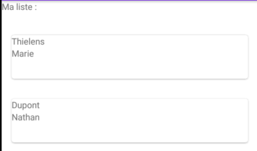

# Liste et adaptateurs

Pour afficher une liste d’éléments cliquables, il nous faut :
- Des données (Array, ArrayList, Cursor, …)
- Un Adapter qui fera l’interface entre les données et les vues
- Une ListView qui affichera les données, ainsi disponibles pour l’utilisateur

## Le layout activity_main.xml

```xml
<?xml version="1.0" encoding="utf-8"?>
<LinearLayout xmlns:android="http://schemas.android.com/apk/res/android"
    xmlns:app="http://schemas.android.com/apk/res-auto"
    xmlns:tools="http://schemas.android.com/tools"
    android:layout_width="match_parent"
    android:layout_height="match_parent"
    tools:context=".MainActivity">

    <TextView
        android:layout_width="wrap_content"
        android:layout_height="wrap_content"
        android:text="Hello World!"
        app:layout_constraintBottom_toBottomOf="parent"
        app:layout_constraintLeft_toLeftOf="parent"
        app:layout_constraintRight_toRightOf="parent"
        app:layout_constraintTop_toTopOf="parent" />

    <Button
        android:id="@+id/btnListe"
        android:layout_width="wrap_content"
        android:layout_height="wrap_content"
        android:text="voir ma liste"
    />

</LinearLayout>
```

## Le fichier MainActivity

- si vous avez une erreur c'est parcqu'il faudra créer le fichier ListActivity. C'est l'activité vers laquelle on se dirige quand on à cliqué sur le bouton

```java
public class MainActivity extends AppCompatActivity {
    private Button btnListe;
        @Override
    protected void onCreate(Bundle savedInstanceState) {
        super.onCreate(savedInstanceState);
        setContentView(R.layout.activity_main);

        btnListe = findViewById(R.id.btnListe); // liaison vue et data
        btnListe.setOnClickListener(v-> {
            ouvrirListe():
        });
        private void ouvrirListe() {
            Intent intent = new Intent(getApplicationContext(), ListActivity.class);
            startActivity(intent);
        }
    }
}
```
- Créer une nouvelle activité : ListActivity

## Le layout de ListActivity (activity_list.xml)

La balise `<ListView />` est le conteneur pour notre liste. Ne pas oublier de lui mettre un id.

```xml
<?xml version="1.0" encoding="utf-8"?>
<LinearLayout xmlns:android="http://schemas.android.com/apk/res/android"
    xmlns:app="http://schemas.android.com/apk/res-auto"
    xmlns:tools="http://schemas.android.com/tools"
    android:layout_width="match_parent"
    android:layout_height="match_parent"
    tools:context=".ListeActivity"
    android:orientation="vertical">
    <!-- Un titre -->
    <TextView
        android:layout_width="match_parent"
        android:layout_height="wrap_content"
        android:text="@string/title_demo_list"
        android:textSize="40sp"
        android:textAlignment="center"
        />
        <!-- Le bouton pour ajouter un élément -->
    <Button
        android:id="@+id/btn_ajout_liste"
        android:layout_width="match_parent"
        android:layout_height="wrap_content"
        android:text="Ajouter element"
        /> -->
        <!-- Ma liste -->
    <ListView
        android:id="@+id/liste_vue"
        android:layout_width="match_parent"
        android:layout_height="wrap_content"
        />

</LinearLayout>
```

## Le fichier ListActivity : afficher une liste

- **adapter** : lien entre la vue recycler et les datas
- **AdapterView** : les vues responsable de l'affichage des listes.

Pour afficher une liste depuis un ensemble de données :  
1. On donne à l'adaptateur une liste d'éléments à traiter.
2. l'adaptateur va créer une vue pour chaque élément en fonction des informations fournies avec le layout à respecter.  
3. Puis, les vues sont fournies à un AdapterView  où elles seront affichées dans l'ordre fourni et avec le layout correspondant. L'AdapterView possède lui aussi un layout afin de le personnaliser. 

```java
public class ListActivity extends AppCompatActivity {

    ListView maListe; // Déclaration de ma ListView que je nomme maListe
    private Button btnAjout;

            @Override
        protected void onCreate(Bundle savedInstanceState) {
            super.onCreate(savedInstanceState);
            setContentView(R.layout.activity_liste);

            // lier
            maListe = findViewById(R.id.list_vue);
            btnAjout = findViewById(R.id.btn_ajout_liste);

            // Créer mes données sous la forme d'un tableau de string
            String[] data = new String [] {"Toi", "moi", "Les autres"};
            
            // Adapter : effectue la liaison entre les données et la vue
            // Constructeur de mon adapteur. Prend un context, un layout, l'id d'une textView de ce layout et les données
            ArrayAdapter<String> monAdapter = new ArrayAdapter<String>(getApplicationContext(),
            android.R.Layout.activity_list_item, // le layout. Une ressource prédéfinie
            android.R.id.text1, //
            data // Mes données ( mon tableau )
            );
            //
            maListe.setAdapter(monAdepter);

            // Ajouter un élément
            btnAjout.setOnClickListener(v-> {
                data.add("nouveau");
                adapter.notifyDataSetChanged(); // Mise à jour de la liste
            });
        }
}
```

Résultat 



# CardView

```xml
<androidx.cardview.widget.CardView
    xmlns:android="http://schemas.android.com/apk/res/android"
    xmlns:card_view="http://schemas.android.com/apk/res-auto"
    android:layout_width="match_parent"
    android:layout_height="wrap_content"
    android:layout_margin="8dp"
    card_view:cardCornerRadius="4dp"
    >
    <!--   background : on lui dit que c'est glissable     -->
    <LinearLayout
        android:id="@+id/root"
        android:layout_width="match_parent"
        android:layout_height="wrap_content"
        android:background="?android:selectableItemBackground"
        android:orientation="horizontal">
    
    <!--   etc...     -->
```
