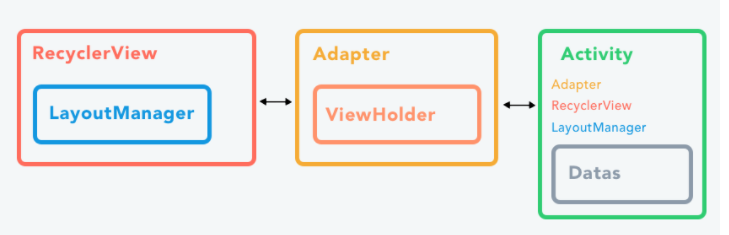
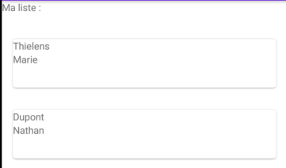

# RecyclerView

Digne successeure de la ListView et de la GridView, la RecyclerView s'impose en étant un pattern plus performant et permettant une personnalisation plus poussée que ces prédécesseures. 

Pour fonctionner, cette dernière a besoin de trois composants obligatoires lors de son implémentation :
- `Un Adapter ( PersonneAdapt.jav)` : Permet de faire la liaison (Bind) entre les données et les vues.
- `Un LayoutManager (main_personne_item.xml)` : Permet de positionner correctement l'ensemble des données de la liste.
- `Un ViewHolder (RecyclerView.ViewHolder)` : Permet de représenter visuellement un élément de la liste de données dans le RecyclerView (Une ligne).



## Implémenter une RecyclerView

On commence par installer la librairie de support Android introduisant la RecyclerView grâce à notre gestionnaire de dépendance Gradle.
- Aller dans le graddle ( le 2 ème et rajouter ces lignes dans les dépendances)
`implementation 'androidx.recyclerview:recyclerview:1.2.0'
    implementation 'androidx.cardview:cardview:1.0.0'`
- Ensuite synchroniser le graddle

## Le layout activity_main.xml

```xml
<?xml version="1.0" encoding="utf-8"?>
<?xml version="1.0" encoding="utf-8"?>
<LinearLayout xmlns:android="http://schemas.android.com/apk/res/android"
    xmlns:app="http://schemas.android.com/apk/res-auto"
    xmlns:tools="http://schemas.android.com/tools"
    android:layout_width="match_parent"
    android:layout_height="match_parent"
    tools:context=".MainActivity"
    android:orientation="vertical">

    <TextView
        android:layout_width="wrap_content"
        android:layout_height="wrap_content"
        android:text="Ma liste : "
        android:layout_marginBottom="20dp"
 />

    <androidx.recyclerview.widget.RecyclerView
        android:id="@+id/rv_recyclerview"
        android:layout_width="match_parent"
        android:layout_height="wrap_content" />

</LinearLayout>
```


Puis, nous allons créer un layout XML représentant chaque item (chaque ligne) de notre RecyclerView.;

## Fichier layout main_personne_item.xml

- Layout , clique droit, new Layout ressource file
-  Chaque ligne de notre liste, donc chaque item, contiendra pour le moment 2 TextView qui afficheront le nom et prenom de chaque utilisateur

```xml
<?xml version="1.0" encoding="utf-8"?>
<LinearLayout xmlns:android="http://schemas.android.com/apk/res/android"
    android:layout_width="match_parent"
    android:layout_height="70dp"
    android:orientation="vertical">
    <TextView
        android:id="@+id/item_personne_nom"
        android:layout_width="match_parent"
        android:layout_height="wrap_content"
        android:text="Nom" />
    <TextView
        android:id="@+id/item_personne_prenom"
        android:layout_width="match_parent"
        android:layout_height="wrap_content"
        android:text="Prenom" />
</LinearLayout>
```



## Avant de faire mon fichier MainItem je vais créer mon dossier models qui contiendra ma classe personne
- dossier java clique droit new pakages nom : models
- dossier modles clique droit new classe nom : Personne

```java
package com.example.listecollection.models;

public class Personne {
    public enum Gender {
        MALE,
        FEMALE
    };

    private String firstname;
    private String lastname;
    private Gender gender;
    // constructeur
    public Personne(String firstname, String lastname, Gender gender) {
        this.firstname = firstname;
        this.lastname = lastname;
        this.gender = gender;
    }
    // Getters and setters
    public String getFirstname() { return firstname; }
    public void setFirstname(String firstname) { this.firstname = firstname; }
    public String getLastname() { return lastname; }
    public void setLastname(String lastname) { this.lastname = lastname; }
    public Gender getGender() { return gender; }
    public void setGender(Gender gender) { this.gender = gender; }

    @Override
    public String toString() {
        return getFirstname() + " " + getLastname().toUpperCase();
    }
}

```

## PersonneAdapter extends RecyclerView.adapter

- Adapteur : fait le lien entre notre composant graphique RecyclerView, notre ArrayList de Personne et notre intefrace graphique personne_item 


## Creer l'adaptateur , lien entre le recycler vue et les datas

Le RecyclerView nécessite un adaptateur pour remplir les vues de chaque ligne avec vos données. Créez un nouveau fichier java.

- Créer un nouveau Package adapter
- Créer une classe dans ce dossier : PersonneAdapter
- Il va hériter `PersonneAdapter extends RecyclerView.Adapter<PersonneAdapter.ViewHolder`
On defini un adapter qui sera un enfant de recyclerView e qui utilise un viewolder qui sera defini dans le PersonneAdapter

```java
// J'étends juste la partie adapter du recycler view
public class PersonneAdapter extends RecyclerView.Adapter<PersonneAdapter.ViewHolder> {

    private ArrayList<Personne> personneData; // Pour les data
    private Context context; // Le programme dans lequel tu es

    // viewOlder : permet de définir les interactions possible sur les vues contenues par le recyclerView
    public static class ViewHolder extends RecyclerView.ViewHolder {

        private TextView tvPrenom, tvNom; // Mes 2 textView présent dans main_personne_item

        public ViewHolder( View v) { // le constructeur que je redéfinis
            super(v);

            // Liaison avec le layout
            tvNom = v.findViewById(R.id.item_personne_nom);
            tvPrenom = v.findViewById(R.id.item_personne_prenom);
        }
        // getters and setters
        public TextView getTvPrenom() { return tvPrenom; }
        public void setTvPrenom(TextView tvPrenom) { this.tvPrenom = tvPrenom; }
        public TextView getTvNom() { return tvNom; }
        public void setTvNom(TextView tvNom) { this.tvNom = tvNom; }
    }

    private RecyclerView monRecycler;

    // Constructeur pour créer l'adapter avec des données
    public PersonneAdapter(ArrayList<Personne> gens) {
        this.personneData = gens;
    }

    // Méthode qui permet de créer les vues contenues dans la liste utilisé par le LayoutManager
    // Créer la vue par mon layout qu'on a crée
    @Override
    public ViewHolder onCreateViewHolder(@NonNull  ViewGroup parent, int viewType) {
        // 
        View v = LayoutInflater.from(parent.getContext()).inflate(R.layout.main_personne_item, parent, false);
        // Renvoie la vue crée encapsulée dans un ViewHolder
        return new ViewHolder(v);
    }

    // Méthode qui permet de mettre à jour la vue avec les données utilisé par le layoutManager
    @Override
    public void onBindViewHolder(@NonNull  PersonneAdapter.ViewHolder holder, int position) {
        // Récupération des données a utiliser
        Personne cible = personneData.get(position);

        // Mise à jour de la vue via le ViewHolder
        holder.getTvPrenom().setText(cible.getFirstname()); // le get dans le holder plus haut / le get dans Personne
        holder.getTvNom().setText(cible.getLastname());
    }
    // Méthode qui permet d'obtenir le nombre d'élément dans la liste utilisé par le LayoutManager
    @Override
    public int getItemCount() {
        return personneData.size();
    }
}
```

## Le fichier main 

```java
public class MainActivity extends AppCompatActivity {

    private RecyclerView monRecycler;

    @Override
    protected void onCreate(Bundle savedInstanceState) {
        super.onCreate(savedInstanceState);
        setContentView(R.layout.activity_main);

        // Créer mon tableau
        ArrayList<Personne> people = new ArrayList<>();
        // Insérer des data dans mon tableau
        people.add(new Personne("Marie", "Thielens", Personne.Gender.FEMALE));
        people.add(new Personne("Nathan", "Dupont", Personne.Gender.MALE));

        // Liaison avec le layout
        monRecycler = findViewById(R.id.rv_recyclerview); // id de mon recycler dans activity_main
        monRecycler.setHasFixedSize(false); // Si des éléments sont rajouté ou enlevé, la modification du contenu de l'adapteur ne modifie ni sa hauteur ni sa largeur

        // Creation du type de layout que le RecyclerView utilise (Linear/Grid/StraggeredGrid)
        RecyclerView.LayoutManager layoutManager =new LinearLayoutManager(this);
        // va permettre de définir le type de layout de mon recycler
        monRecycler.setLayoutManager(layoutManager);


        // Viens de Personne adapter
        PersonneAdapter adapter = new PersonneAdapter(people);
        monRecycler.setAdapter(adapter);
        // getText recupere le texte to sting recuperer sa valeur
    }
}
```

