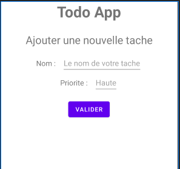
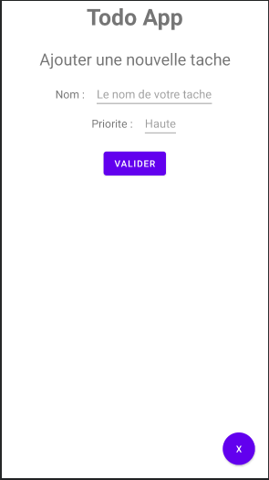

# Suite du point 9. Ajouter une nouvelle activité

- J'ai rajouté une dimension pour la taille de mes texte dans res > values > dimension 
    ` <dimen name="taille_texte_normal">17dp</dimen>`
- J'ai rajouter un margin pour qu'il y ai de l'espace apres mon titre dans mon style général res > value > styleGeneral
    `<item name="android:layout_marginBottom">25dp</item>` 

## Créer votre nouvelle activity et son layout

- sur le dossier com.marie.todolist clique droit, ajouter une nouvelle class : je l'appelle AjouterActivity
- On va s'occuper du layout pour commencer. Aller dans res > layout > activity_ajouter



```xml
<?xml version="1.0" encoding="utf-8"?>
<LinearLayout xmlns:android="http://schemas.android.com/apk/res/android"
    xmlns:app="http://schemas.android.com/apk/res-auto"
    xmlns:tools="http://schemas.android.com/tools"
    android:layout_width="match_parent"
    android:layout_height="match_parent"
    tools:context=".AjouterActivity"
    android:orientation="vertical"
    >
    <TextView
        android:id="@+id/todo_item_titreG"
        android:layout_width="wrap_content"
        android:layout_height="wrap_content"
        android:text="Todo App"
        style="@style/titre_general_style"
         />
    <TextView
        android:id="@+id/texte_ajouter"
        android:layout_width="match_parent"
        android:layout_height="wrap_content"
        android:text="Ajouter une nouvelle tache"
        android:textSize="25dp"
        android:gravity="center_horizontal"
        android:layout_marginBottom="15dp"
        />
    <LinearLayout
        android:layout_width="match_parent"
        android:layout_height="wrap_content"
        android:orientation="horizontal"
        android:gravity="center_horizontal">
        <TextView
            android:id="@+id/texte_ajouter_nom"
            android:layout_width="wrap_content"
            android:layout_height="wrap_content"
            android:text="Nom :"
            android:textSize="@dimen/taille_texte_normal"
            android:layout_marginRight="15dp"/>
        <EditText
            android:id="@+id/input_nom_ajouter"
            android:layout_width="wrap_content"
            android:layout_height="wrap_content"
            android:hint="Le nom de votre tache" />
    </LinearLayout>
    <LinearLayout
        android:layout_width="match_parent"
        android:layout_height="wrap_content"
        android:orientation="horizontal"
        android:gravity="center_horizontal"
        android:layout_marginBottom="15dp">
        <TextView
            android:id="@+id/texte_ajouter_priorite"
            android:layout_width="wrap_content"
            android:layout_height="wrap_content"
            android:text="Priorite :"
            android:textSize="@dimen/taille_texte_normal"
            android:layout_marginRight="15dp"/>
        <EditText
            android:id="@+id/input_priorite_ajouter"
            android:layout_width="wrap_content"
            android:layout_height="wrap_content"
            android:hint="Haute" />
    </LinearLayout>
    <Button
        android:id="@+id/btn_valider_tache"
        android:layout_width="wrap_content"
        android:layout_height="wrap_content"
        android:text="Valider"
        android:layout_gravity="center_horizontal"/>
</LinearLayout>
```

## Modifier le layout pour avoir un bouton rond pour revenir en arrière

res > drawable > créer un nouveau fichier clique droit new drawable file : Je l'appelle btn_rond

```xml
<?xml version="1.0" encoding="utf-8"?>
<selector xmlns:android="http://schemas.android.com/apk/res/android">
    <item>
        <shape android:shape="oval">
            <solid android:color="#E53935"/>
            <size android:width="150dp" android:height="150dp"/>
        </shape>
    </item>
</selector>
```

## Modifier le layout activity_ajouter.xml pour mettre notre bouton

- Rajouter ceci à la fin de votre code (mais avant la fermeture du dernier Linearlayout)

```xml
    <RelativeLayout
        android:layout_width="match_parent"
        android:layout_height="match_parent"
        android:gravity="bottom|end">
        <Button
            android:id="@+id/btn_retour_accueil"
            android:layout_width="50dp"
            android:layout_height="50dp"
            android:text="X"
            android:background="@drawable/btn_rond"
            android:backgroundTint="#E53935"
            android:layout_marginRight="20dp"
            android:layout_marginBottom="20dp"
            />
    </RelativeLayout>
```



## Modifier AjouterActivity pour avoir un intent qui nous fait revenir sur la page d'acceuil

```java
public class AjouterActivity extends AppCompatActivity {
    
    private Button btnRetourAccueil;

    @Override
    protected void onCreate(Bundle savedInstanceState) {
        super.onCreate(savedInstanceState);
        setContentView(R.layout.activity_ajouter);

        btnRetourAccueil = findViewById(R.id.btn_retour_accueil);
        btnRetourAccueil.setOnClickListener(v -> {
            Intent intent = new Intent(getApplicationContext(), MainActivity.class);
            startActivity(intent);
        });
    }
}
```

