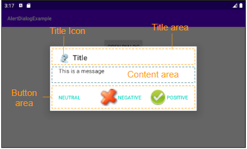

# AlertDialog

Android AlertDialog est une boîte de dialogue qui affiche un message et assiste 1, 2 ou 3 buttons. Elle facilite la création d'une boîte de dialogue avec quelques lignes de code.

AlertDialog se compose de trois zones:

- Zone de titre (Title area)
- Zone de contenu (Content area)
- Zone des boutons (Buttons area)



## Title area

Utiliser la méthode `setTitle()`, `setIcon()` pour définir le titre et l'icône d'une boîte de dialogue qui sont affichés dans Title area. Ou utilisez la méthode `setCustomTitle(View)` si vous voulez obtenir une zone de titre (Title area) personnalisée.

## Content area

La Zone de contenu (Content area) peut afficher un message, une liste des options, etc.

## Buttons area

Cette zone contient au maximum trois bouttons: **Positive button, Negative button, Neutral button**, dans lequels les deux premiers assistent **Text & Icon**, alors que **Neutral button** assiste uniquement **Text**, cependant, vous pouvez faire afficher son icône avec une petite astuce (Voir plus dans l'exemple).


## Exemple

J'ai dans mon fichier main un bouton qui permet de tout supprimer (toutes mes taches).
Je vais mettre une alertDialog sur ce bouton afin de demander à l'utilisateur si il est sûr de vouloir tout supprimer 

```java

btnToutSupprimer = findViewById(R.id.btn_supprimer);
btnToutSupprimer.setOnClickListener(v -> {
    ouvrirDialogue();
});

    // Boite de dialogue.........................

    private void ouvrirDialogue(){

        AlertDialog.Builder builder = new AlertDialog.Builder(this); // context

        // Empecher de pouvoir appuyer sur la touche retour
        builder.setCancelable(false);

        // envoyer le message title
        builder.setTitle("Etes vous sur ?");
        builder.setPositiveButton("Supprimer", new DialogInterface.OnClickListener() {
            @Override
            public void onClick(DialogInterface dialog, int which) {
                deleteDatabase(DbRequete.DB_NAME); // Je supprime ma db
            }
        });
        builder.setNegativeButton("Non", new DialogInterface.OnClickListener() {
            @Override
            public void onClick(DialogInterface dialog, int which) {
            // Il ne se passe rien
            }
        })
        .show();
```