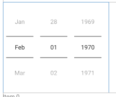

# Un input avec un calendrier

## 1. Un petit exemple



Dans mon layout : 
```xml
    <DatePicker
        android:layout_width="wrap_content"
        android:layout_height="wrap_content"
        android:datePickerMode="spinner"
        android:calendarViewShown="false"
        />
```

## 2. Le calendrier de ma todo liste DatePickerDialog

DatePickerDialog va s'ouvrir comme une fenêtre popup.
Lorsque je clique sur mon ImageView, mon datePicker va s'ouvrir.

### Le layout : activity_ajouter_xml

```xml
        <LinearLayout
            android:layout_width="match_parent"
            android:layout_height="wrap_content"
            android:orientation="horizontal"
            android:gravity="center_horizontal"
            android:layout_marginBottom="15dp"
            android:layout_marginStart="20dp"
            android:layout_marginEnd="20dp"
            >
            <TextView
                android:id="@+id/text_date_limite"
                android:layout_width="wrap_content"
                android:layout_height="wrap_content"
                android:text="@string/date_limite"/>
            <EditText
                android:id="@+id/editText_date_limite"
                android:layout_width="0dp"
                android:layout_height="wrap_content"
                android:inputType="date"
                android:layout_weight="1"
                />
            <ImageView
                android:id="@+id/btn_calendrier"
                android:layout_width="40dp"
                android:layout_height="40dp"
                android:src="@drawable/calendar_vector"
                android:layout_marginStart="10dp"
                />
    </LinearLayout>
```

### le fichier aAjouterActivity.java

```java
    private EditText inputAjouterDate;
    private ImageView btnCalendar;
    private LocalDate dateLimite = null;

    @Override
    protected void onCreate(Bundle savedInstanceState) {
        super.onCreate(savedInstanceState);
        setContentView(R.layout.activity_ajouter);

            inputAjouterDate = findViewById(R.id.editText_date_limite);
            btnCalendar = findViewById(R.id.btn_calendrier);

            // le calendrier  ..............
            // Désactivation de la saisie via le clavier
            inputAjouterDate.setInputType(InputType.TYPE_NULL);

            Calendar calendar = Calendar.getInstance();
            int jour = calendar.get(Calendar.DAY_OF_MONTH);
            int mois = calendar.get(Calendar.MONTH);
            int annee = calendar.get(Calendar.YEAR);

            btnCalendar.setOnClickListener(v -> {
                DatePickerDialog picker = new DatePickerDialog(AjouterActivity.this,
                        new DatePickerDialog.OnDateSetListener() { // l'utilisateur à cliqué sur une date
                            @Override
                            public void onDateSet(DatePicker view, int year, int month, int dayOfMonth) {

                                // je récupère le contexte de l'pp > puis les ressources > la configuration > locale (langue utilisé) > la 1ere
                                Locale locale = AjouterActivity.this.getResources().getConfiguration().getLocales().get(0) ;

                                // mois + 1 pcq datePicker et le calendar vont de 0 à 11, le localdate de 1 jusqu à 12
                                dateLimite = LocalDate.of(year, month + 1, dayOfMonth);
                                // Foramter en string la date pour que l'année soit à la fin
                                String date = dateLimite.format(DateTimeFormatter.ofPattern("dd MMMM yyyy", Locale.FRENCH));
                                inputAjouterDate.setText(date); // Rajouter la date dans mon input
                                
                            }
                        },
                        annee, mois, jour );

                picker.show();
        });
    }
}

```

## Modifier le style de mon calendrier pour que ce soit un calendrier déroulant

### Rajouter un thème ( on aurait pu faire un style mais par convention theme est mieux)

value > theme > theme.xml

```xml
    <!--    Theme de mon datePicker (mon calendrier ) -->
    <style name="Calendrier" parent="android:Widget.Material.DatePicker">
        <item name="android:datePickerMode">spinner</item>
        <item name="android:calendarViewShown">false</item>
    </style>

    <style name="CalendrierDialogue" parent="android:Theme.Material.Dialog">
        <item name="android:datePickerStyle">@style/Calendrier</item>
<!--        <item name="actionMenuTextColor"></item>-->
    </style>

```

###