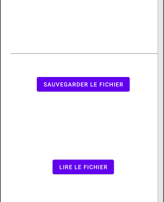

# Le stockage de fichier ( version simple ) 



## fichier main_activity.xml

```xml
<?xml version="1.0" encoding="utf-8"?>
<androidx.constraintlayout.widget.ConstraintLayout
    xmlns:android="http://schemas.android.com/apk/res/android"
    xmlns:app="http://schemas.android.com/apk/res-auto"
    xmlns:tools="http://schemas.android.com/tools"
    android:layout_width="match_parent"
    android:layout_height="match_parent"
    tools:context=".MainActivity">

    <EditText
        android:id="@+id/ecrireTexte"
        android:layout_width="0dp"
        android:layout_height="122dp"
        android:layout_marginStart="21dp"
        android:layout_marginLeft="21dp"
        android:layout_marginTop="20dp"
        android:layout_marginEnd="16dp"
        android:layout_marginRight="16dp"
        android:ems="10"
        android:inputType="textPersonName"
        app:layout_constraintEnd_toEndOf="parent"
        app:layout_constraintStart_toStartOf="parent"
        app:layout_constraintTop_toTopOf="parent" />

    <Button
        android:id="@+id/button_save"
        android:layout_width="wrap_content"
        android:layout_height="wrap_content"
        android:layout_marginTop="44dp"
        android:text="Sauvegarder le fichier"
        app:layout_constraintEnd_toEndOf="parent"
        app:layout_constraintStart_toStartOf="parent"
        app:layout_constraintTop_toBottomOf="@+id/ecrireTexte" />

    <TextView
        android:id="@+id/textLire"
        android:layout_width="0dp"
        android:layout_height="91dp"
        android:layout_marginStart="29dp"
        android:layout_marginLeft="29dp"
        android:layout_marginTop="29dp"
        android:layout_marginEnd="21dp"
        android:layout_marginRight="21dp"
        app:layout_constraintEnd_toEndOf="parent"
        app:layout_constraintStart_toStartOf="parent"
        app:layout_constraintTop_toBottomOf="@+id/button_save" />

    <Button
        android:id="@+id/btn_lire"
        android:layout_width="wrap_content"
        android:layout_height="wrap_content"
        android:layout_marginTop="38dp"
        android:text="lire le fichier"
        app:layout_constraintEnd_toEndOf="parent"
        app:layout_constraintStart_toStartOf="parent"
        app:layout_constraintTop_toBottomOf="@+id/textLire" />
</androidx.constraintlayout.widget.ConstraintLayout>
```

## fichier MainActivity

- **FileOutputStream** : est un flux de sortie pour l'écriture de données vers un fichier. En Java, L'écriture des données binaires se fait avec le flux d'écriture FileOutputStream. Pour écrire dans un fichier, vous devez convertir les données en bits et les sauvegarder dans un fichier.
- **getBytes()** : convertir en données binaires
- **StringBuilder** :  permet de concaténer des chaînes de caractères de manière optimisée.

- **reader.readLine()** :  renvoie une chaîne de caractère. Ensuite, la boucle itérera jusqu’à ce qu’elle ne soit plus nulle.

```java
public class MainActivity extends AppCompatActivity {

    String simpleFichierNom = "super.txt";
    private Button btnSauver, btnLire;
    private EditText ecrireTexteFichier;
    private TextView lireTexteFichier;


    @Override
    protected void onCreate(Bundle savedInstanceState) {
        super.onCreate(savedInstanceState);
        setContentView(R.layout.activity_main);

        btnSauver = findViewById(R.id.button_save);
        btnLire = findViewById(R.id.btn_lire);
        ecrireTexteFichier = findViewById(R.id.ecrireTexte);
        lireTexteFichier = findViewById(R.id.textLire);

        // Ecouter les boutons.........................
        btnSauver.setOnClickListener(v -> {
            sauvegarder();
        });
        btnLire.setOnClickListener(v -> {
            lire();
        });
    }
    // sauvegarder le contenu que j'ai tapé dans un fichier............
    private void sauvegarder() {

        String monTexte = ecrireTexteFichier.getText().toString();

        // android veut qu'on puisse avoir une exeption
        try { // try : code à risque
            // flux de sortie pour l'écriture de données vers un fichier
            // private ; ne peut être consulté que par l'application
            FileOutputStream gererFichier = openFileOutput(simpleFichierNom, MODE_PRIVATE);
            // convertir en données binaires
            gererFichier.write(monTexte.getBytes());

        } catch (IOException e) { // fichier systeme
            Toast.makeText(this, "Erreur : ", Toast.LENGTH_LONG).show();
        }
    }

    // Le fichier en mode lecture...............
    private void lire(){
        try{
            // permet d'ouvrir un fichier en lecture et d'en lire le contenu
            FileInputStream lireFichier = openFileInput(simpleFichierNom);
            // permet de lire ( ligne par ligne )
            BufferedReader maLecture = new BufferedReader(new InputStreamReader(lireFichier));
            // permet de concaténer des chaînes de caractères de manière optimisée
            StringBuilder data = new StringBuilder();
            String maLigne;
            // va lire le fichier jusqu’à la fin du fichier
            while((maLigne = maLecture.readLine())!=null) { // tant qu'il y a une ligne, une chaine de caractère
                // rajouter la ligne et un saut de ligne
                data.append(maLigne).append("\n");
            }
            this.lireTexteFichier.setText(data.toString());
        }catch (Exception e) {
            Toast.makeText(this, "Erreur : ", Toast.LENGTH_LONG).show();
        }
    }
}
```