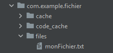

# La persistence des données : Les fichiers

**Android Internal Storage**: Un lieu de stockage de données privées de chaque application, ces données sont stockées et utilisées pour leur propre application. D'autres applications ne peuvent y accéder. Normalement, lorsque l'application est supprimée dans des appareils Android, le fichier de données associé est également supprimé.




## Mon layout : main_activity.xml

```xml
<?xml version="1.0" encoding="utf-8"?>
<RelativeLayout xmlns:android="http://schemas.android.com/apk/res/android"
    xmlns:app="http://schemas.android.com/apk/res-auto"
    xmlns:tools="http://schemas.android.com/tools"
    android:layout_width="match_parent"
    android:layout_height="match_parent"
    tools:context=".MainActivity"
    >
    <EditText
        android:id="@+id/edit"
        android:layout_width="match_parent"
        android:layout_height="200dp"
        android:gravity="top|start"
        android:background="@null"
        />
    <Button
        android:layout_width="wrap_content"
        android:layout_height="wrap_content"
        android:id="@+id/btn_main_action"
        android:text="EDIT"
        android:layout_alignParentEnd="true"
        android:backgroundTint="#74039BE5"
        />
</RelativeLayout>
```

## Mon fichier MainActivity.java

```java
public class MainActivity extends AppCompatActivity {

    boolean editMode = false; // Au départ je ne peux pas écrire dans mon "inputText"
    EditText etContent;
    Button btnAction;

    @Override
    protected void onCreate(Bundle savedInstanceState) {
        super.onCreate(savedInstanceState);
        setContentView(R.layout.activity_main);

                etContent = findViewById(R.id.edit);
                btnAction = findViewById(R.id.btn_main_action);

                btnAction.setOnClickListener(v -> {
                    if(editMode) { // Si je suis en mode d'édition
                        saveContent(); // Je sauve le contenu
                        switchToReadMode(); // Ma méthode pour passer en mode lecture
                    }
                    else {
                        switchToEditMode();
                    }
                });
                switchToReadMode();
                loadContent();
    }
    private void switchToReadMode(){
        // pour éviter qu'on puisse écrire dessus
        etContent.setEnabled(false); // setEnable rend ecrivable
        etContent.clearFocus(); // empecher d'écrire sur le clavier
        btnAction.setText("Edit");
        editMode = false; // Apres avoir cliqué sur save je désactive l'édit mode
    }
    private void switchToEditMode() {
        etContent.setEnabled(true); // setEnable rend ecrivable
        //etContent.setInputType(InputType.TYPE_TEXT_FLAG_MULTI_LINE); // On dit le type de texte
        etContent.setImeOptions(EditorInfo.IME_FLAG_NO_ENTER_ACTION); // pour avoir le clavier avec saut de ligne
        btnAction.setText("Save"); // Change le titre de mon bouton
        editMode = true;
    }
    
    
    // Sauvegarder le contenu de mon edit texte dans un fichier
    private void saveContent() {
        // Alternative avec un fichier externe a l'app  (Necessite une permission dans le manifest !!!)
        String content = etContent.getText().toString(); // Le contenu du texte que je veux sauvgarder
        // File f1 = new File(getExternalFilesDir(Environment.DIRECTORY_PICTURES),  "monFichier.txt")

        try {
            FileOutputStream fos;
            // openFileOutput(nom du fichier, mode ). Pour créer ou ouvrir un fichier
            fos = openFileOutput("monFichier.txt", MODE_PRIVATE); // append rajouter , private réecrire
            fos.write(content.getBytes()); 
            fos.close();
        } catch (IOException e) {
            Toast.makeText(this, "Erreur : ", Toast.LENGTH_LONG).show();
        }
    }
        private void loadContent() {
            try {
               // flux de lecture
                FileInputStream fis = openFileInput("MonFichier.txt");

                // outil qui permet de lire le contenu du flux de lecture
                BufferedReader reader = new BufferedReader(new InputStreamReader(fis)); // lit ligne par ligne

                // Le conteneur des données qu'on va lier
                StringBuilder data = new StringBuilder();

                // Lecture du fichier via le reader
                String line;
                while( (line = reader.readLine()) != null ){ // Tant qu'il reste une ligne
                    data.append(line); // rajouter la ligne
                    data.append("\n"); // Rajouter un saut à la ligne
                }
                data.deleteCharAt(data.length() - 1); // Supprimer le dernier saut de ligne
                reader.close(); // Fermeture du reader
                fis.close(); // fermeture du flux

                String content = data.toString(); // Transforamtion de mes données en string
                etContent.setText(content); // Affiche le contenu sur l'éditText
            } catch (IOException e) {
                Toast.makeText(this , "Erreur : " , Toast.LENGTH_LONG).show();
        }
    }
}
```
