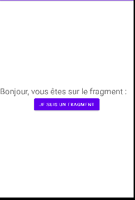

# Fragment

Les fragments permettent de scinder vos activités en composants encapsulés et réutilisables qui possèdent leur propre cycle de vie et leur propre interface graphique. Cela permet de mettre en place des I.H.M. évoluées qui s'adaptent aux différents écrans et à leur orientation.

- **onAttach()**, on récupère un pointeur vers l'activité contenante (attention aux NullPointerException, celle-ci n'a pas finalisé sa construction) ;
- **onCreate()**, on instancie les objets non graphiques ;
- **onCreateView**, on instancie la vue et les composants graphiques ;
- **onActivityCreate**, on récupère un pointeur sur l'activité (qui est construite), on lance les initialisations qui ont besoin de cette activité, on restaure le contexte des fragments et utilisateur.
- **onStart**, on lance les traitements ;
- **onResume**, on s'abonne et on remet le contexte utilisateur ;
- **onPause**, on se désabonne et on enregistre le contexte utilisateur ;
- **onStop**, on arrête les traitements et on désalloue les objets ;
- **onDestroyView**, la vue est détachée de celle de l'activité, on peut délivrer la mémoire des objets graphiques ;
- **onDestroy**, je ne préconise pas grand-chose ;
- **onDetach**, non plus.

## Création du premier fragment
Nous allons créer maintenant notre premier fragment, MainFragment. Pour cela rien de plus simple, il suffit de faire un clic droit sur notre package "Fragments" et cliquer sur New > Fragment > Fragment(Blank) puis nommer  votre premier fragment **MainFragment**

## Gérer les fragment de façon statique

- **La manière statique** : Très facile à utiliser, elle nous permet d'ajouter un fragment directement depuis le ]**layout** d'une activité (par exemple activity_main.xml). Cependant, celui-ci ne pourra plus être retiré ou modifié dynamiquement. C'est cette méthode que j'ai choisi de vous présenter dans ce chapitre.

- **La manière dynamique** : L'ajout ou la suppression de fragment se fera directement depuis le **FragmentManager** de l'activité parente (MainActivity.java). 

## Créer le fichier MainFragment

New > Fragment > Fragment(Blank) puis nommer votre premier fragment **MainFragment**

```java
// Hérite de la classe mère Fragment
public class MainFragment extends Fragment {

    public MainFragment() {
        // Required empty public constructor
    }

    @Override
    // Permet de récupérer le layout afin de le définir comme layout principal
    public View onCreateView(LayoutInflater inflater, ViewGroup container, Bundle savedInstanceState) {

        // paramètre est à false . Ce paramètre spécifie si la vue doit être automatiquement attachée à son container parent.
        // Dans le cas d'un fragment, cette liaison doit être laissée au système qui se charge de la rattacher comme il se doit à l'activité.
        return inflater.inflate(R.layout.fragment_main, container, false);
    }
}
```

### Fichier fragment_main.xml



```xml
<?xml version="1.0" encoding="utf-8"?>
<LinearLayout xmlns:android="http://schemas.android.com/apk/res/android"
    xmlns:tools="http://schemas.android.com/tools"
    android:layout_width="match_parent"
    android:layout_height="match_parent"
    tools:context=".MainFragment"
    android:orientation="vertical"
    android:gravity="center_vertical|center_horizontal"
    >
    <TextView
        android:id="@+id/titre_f"
        android:layout_width="fill_parent"
        android:layout_height="wrap_content"
        android:text="Bonjour, vous êtes sur le fragment : "
        android:textSize="25sp"/>

    <Button
        android:id="@+id/btn_fragment"
        android:layout_width="wrap_content"
        android:layout_height="wrap_content"
        android:text="Je suis un fragment"
        />
</LinearLayout>
```

Maintenant, nous allons intégrer littéralement notre fragment MainFragment dans l'activité MainActivity via son layout activity_main.xml.

### Ajouter le fragment dans activity_main.xml

 Grâce à l'attribut **"android:name"**, nous réalisons la liaison avec le fragment MainFragment.

```xml
<?xml version="1.0" encoding="utf-8"?>
<LinearLayout xmlns:android="http://schemas.android.com/apk/res/android"
    xmlns:app="http://schemas.android.com/apk/res-auto"
    xmlns:tools="http://schemas.android.com/tools"
    android:layout_width="match_parent"
    android:layout_height="match_parent"
    tools:context=".MainActivity"
    android:orientation="vertical"
    android:gravity="center"
    >
<!--name= quelle classe prend en charge le fragment-->
<fragment
    xmlns:android="http://schemas.android.com/apk/res/android"
    android:id="@+id/parent_fragment_liste"
    android:layout_width="match_parent"
    android:layout_height="match_parent"
    android:name="com.example.fragment.MainFragment"
    />
</LinearLayout>
```

## Communication entre le fragment et l'activité

Je voudrais que le bouton envoie vers un autre fragment


