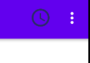

# Material Design

https://fonts.google.com/icons?selected=Material+Icons

- Choisir l'icone, la télécharger
- prendre tous les fichiers et les copier dans le dossier drawable
- clique droit sur res > New image Asset > Action Bar and Tab Icons

- Clique sur le petit bonhomme (clip art ) et je vais pouvoir choisir une  image
- **trim** : Prend toute la place de son container (oui)
- **theme** : custom pour choisir soi-même la couleur de l'icone

itemId = donne un id à notre item, order : permettra de modifier l'odre par rapport à l'ajout, le titre 

# Menu Hamburger



Apres la méthode onCreate 

```java
public class MainActivity extends AppCompatActivity {

    private static final int ID_ITEM1 = 1;
    private static final int ID_ITEM2 = 2;

    @Override
    protected void onCreate(Bundle savedInstanceState) {
        super.onCreate(savedInstanceState);
        setContentView(R.layout.activity_main);
    }

    @Override
    public boolean onCreateOptionsMenu(Menu menu) {
            // groupId, id de l'item, je ne gère pas l'ordre, titre .
            // rajouter l'image à mon menu (choisir l'icone dans drawable) .
            // .setShowAsAction() : i ndiquer que notre icone apparrait sur notre barre
            menu.add(0,ID_ITEM1,0, "Menu 1").setIcon(R.drawable.horloge).setShowAsAction(MenuItem.SHOW_AS_ACTION_ALWAYS);
            // Il est impossible de mettre une image dans le menu déroulant
            menu.add(0,ID_ITEM2,0, "Menu 2");
            return super.onCreateOptionsMenu(menu);
    }
    @Override
    // Un callback sur mon menu
    public boolean onOptionsItemSelected(MenuItem item) {
        // savoir sur quel item on a pressé
        if(item.getItemId() == 1) {
            Toast.makeText(this, item.getTitle(), Toast.LENGTH_SHORT).show();
        }
        else {
            Toast.makeText(this, item.getTitle(), Toast.LENGTH_SHORT).show();
        }
        return  super.onOptionsItemSelected(item);
    }
}
```
