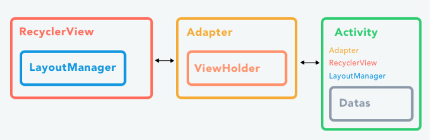

# RecyclerView

Digne successeure de la ListView et de la GridView, la RecyclerView s'impose en étant un pattern plus performant et permettant une personnalisation plus poussée que ces prédécesseures. 

Pour fonctionner, cette dernière a besoin de trois composants obligatoires lors de son implémentation :
- **Un Adapter (RecyclerView.Adapter)** : Permet de faire la liaison (Bind) entre la vue RecyclerView et une liste de données.
- **Un LayoutManager (RecyclerView.LayoutManager)** : Permet de positionner correctement l'ensemble des données de la liste.
- **Un ViewHolder (RecyclerView.ViewHolder)** : Permet de représenter visuellement un élément de la liste de données dans le RecyclerView (Une ligne).



## Implémenter une RecyclerView

On commence par installer la librairie de support Android introduisant la RecyclerView grâce à notre gestionnaire de dépendance Gradle.
- Aller dans le graddle ( le 2 ème et rajouter ces lignes dans les dépendances)
`    implementation 'androidx.recyclerview:recyclerview:1.2.0'
    implementation 'androidx.cardview:cardview:1.0.0'`
- Ensuite synchroniser le graddle

## Le layout activity_main.xml

```xml
<?xml version="1.0" encoding="utf-8"?>
<RelativeLayout xmlns:android="http://schemas.android.com/apk/res/android"
    xmlns:app="http://schemas.android.com/apk/res-auto"
    xmlns:tools="http://schemas.android.com/tools"
    android:layout_width="match_parent"
    android:layout_height="match_parent"
    tools:context=".MainActivity">

    <TextView
        android:layout_width="wrap_content"
        android:layout_height="wrap_content"
        android:text="Hello World!"
        app:layout_constraintBottom_toBottomOf="parent"
        app:layout_constraintLeft_toLeftOf="parent"
        app:layout_constraintRight_toRightOf="parent"
        app:layout_constraintTop_toTopOf="parent" />
    
    <androidx.recyclerview.widget.RecyclerView
        android:id="@+id/rv_recyclerview"
        android:layout_width="match_parent"
        android:layout_height="wrap_content" />

</RelativeLayout>
```

Puis, nous allons créer un layout XML représentant chaque item (chaque ligne) de notre RecyclerView.;

## Fichier layout main_item.xml
- Layout , clique droit, 

```xml
<?xml version="1.0" encoding="utf-8"?>
<LinearLayout xmlns:android="http://schemas.android.com/apk/res/android"
    android:layout_width="match_parent"
    android:layout_height="70dp"
    android:orientation="vertical">
    <TextView
        android:id="@+id/item_personne_nom"
        android:layout_width="match_parent"
        android:layout_height="wrap_content"
        android:text="Nom" />
    <TextView
        android:id="@+id/item_personne_prenom"
        android:layout_width="match_parent"
        android:layout_height="wrap_content"
        android:text="Prenom" />
</LinearLayout>
```