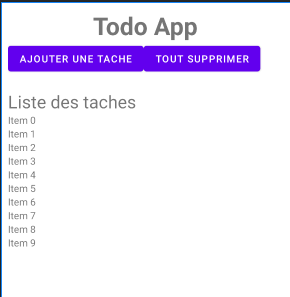
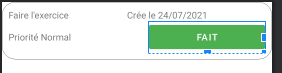

# Todo List

## Etapes

### Le recycler vue
- 1. Layout mainActivity qui aura ma recycler view
- 2. Mon propre style (les titres sont pareils, une bordure autour des items, le vert pour le bouton; ect )
- 3. Layout todo_item : le layout de chaque item (chaque bloc)
- 4. Models > Tache : le constructeur, la carte d'identité de mes tâches
- 5. TacheAdapter : qui étend le recycler vue

### Liason avec la db

## 1. Layout mainActivity ( mise en page de l'activité MainActivity ) 

- A ameliorer
- Se trouve dans res > layout > mainActivity.xml
- !!!! comme on utilise une recyclerView ( la dernière balise ) il faut ABSOLUMENT dire à android studio qu'on utilise une bibliotheque externe. Il faut aller dans le *Graddle script > build.gradle* (le 2 ème) et rajouter ceci dans la balise dependencies `implementation 'androidx.recyclerview:recyclerview:1.2.0'`
    `implementation 'androidx.cardview:cardview:1.0.0'`



Pour l'instant cette ligne `style="@style/titre_general_style"` ne fonctionnera pas car je fais mon propre style en point 2 

```xml
<?xml version="1.0" encoding="utf-8"?>
<LinearLayout xmlns:android="http://schemas.android.com/apk/res/android"
    xmlns:app="http://schemas.android.com/apk/res-auto"
    xmlns:tools="http://schemas.android.com/tools"
    android:layout_width="match_parent"
    android:layout_height="match_parent"
    tools:context=".MainActivity"
    android:orientation="vertical"
    android:padding="10dp">

    <TextView
        android:id="@+id/todo_item_titreG"
        android:layout_width="wrap_content"
        android:layout_height="wrap_content"
        android:text="Todo App"
        style="@style/titre_general_style"/>
    <LinearLayout
        android:layout_width="match_parent"
        android:layout_height="wrap_content"
        android:orientation="horizontal"
        android:layout_marginBottom="20sp">
        <Button
            android:id="@+id/btn_ajout"
            android:layout_width="wrap_content"
            android:layout_height="wrap_content"
            android:text="Ajouter une tache" />
        <Button
            android:id="@+id/btn_supprimer"
            android:layout_width="wrap_content"
            android:layout_height="wrap_content"
            android:text="Tout supprimer" />
    </LinearLayout>

    <TextView
        android:id="@+id/general_titre_taches"
        android:layout_width="match_parent"
        android:layout_height="wrap_content"
        android:text="Liste des taches"
        android:textSize="25dp"/>
    <androidx.recyclerview.widget.RecyclerView
        android:id="@+id/rv_toDo"
        android:layout_width="match_parent"
        android:layout_height="wrap_content"
        />
</LinearLayout>
```

## 2. Mon propre style

les titres sont pareils, une bordure autour des items, le vert pour le bouton, ect ...

- Rajouter une couleur verte pour mon bouton : res > values > colors  : `<color name="vert_btn">#FF4CAF50</color>`
    - Vous verrez ensuite dans le point 3 (todo_item.xml) comment l'utiliser

- Mettre des dimensions (tous les titres ont la même taille) : res > values, clique droit, new value ressource file : je l'appelle dimension
    - Mettre ce code et on va l'utiliser dans notre propre style qu'on va créer juste après.
```xml
<?xml version="1.0" encoding="utf-8"?>
<resources>
    <dimen name="taille_titre">35dp</dimen>
</resources>
```
- Mon propre style ( pour mon titre par exemple, comme ils seront tous pareil)
    - Créer notre fichier de style res > values , clique droit new values ressource file : moi je l'appelle styleGeneral 
    - Voici comment il a été utilisé dans le fichier layout_activity dans la balise TextView `style="@style/titre_general_style"`

```xml
<?xml version="1.0" encoding="utf-8"?>
<resources>
<!--  Titre  -->
    <style name="titre_general_style" >
        <item name="android:textSize">@dimen/taille_titre</item>
        <item name="android:layout_gravity">center</item>
        <item name="android:textStyle">bold</item>
    </style>
</resources>
```

- Ma bordure
    - Dans res > drawable clique droit new drawable ressource file je l'appelle bordure

```xml
<?xml version="1.0" encoding="utf-8"?>
 <shape xmlns:android="http://schemas.android.com/apk/res/android" android:shape="rectangle">
    <corners android:radius="20dp"/>
    <padding android:left="10dp" android:right="10dp" android:top="10dp" android:bottom="10dp"/>
    <stroke android:width="0.5dp" android:color="#FF000000"/>
</shape>
```

## 3. todo_item.xml : Le layout de chaque élément

- res > layout , clique droit , new layout ressource file . Moi je l'appelle todo_item



Mon propre style détail     
    - La couleur verte de mon bouton `android:backgroundTint="@color/vert_btn"`
    - La bordure sur ma première balise `android:background="@drawable/bordure"`

```xml
<?xml version="1.0" encoding="utf-8"?>
<LinearLayout xmlns:android="http://schemas.android.com/apk/res/android"
    android:layout_width="match_parent"
    android:layout_height="wrap_content"
    android:orientation="vertical"
    android:outlineAmbientShadowColor="@color/black"
    android:background="@drawable/bordure">
    <LinearLayout
        android:layout_width="match_parent"
        android:layout_height="wrap_content"
        android:orientation="horizontal">
        <TextView
            android:id="@+id/todo_item_titre"
            android:layout_width="wrap_content"
            android:layout_height="wrap_content"
            android:text="Faire l'exercice"
            android:layout_weight="1"
            />
        <TextView
            android:id="@+id/todo_item_date"
            android:layout_width="wrap_content"
            android:layout_height="wrap_content"
            android:text="Crée le 24/07/2021"
            android:layout_weight="1"
        />
    </LinearLayout>

    <LinearLayout
        android:layout_width="match_parent"
        android:layout_height="wrap_content"
        android:orientation="horizontal" >

    <TextView
        android:id="@+id/todo_item_importance"
        android:layout_width="wrap_content"
        android:layout_height="wrap_content"
        android:layout_weight="1"
        android:text="Priorité Normal" />

    <Button
        android:id="@+id/todo_item_btn_fini"
        android:layout_width="60sp"
        android:layout_height="wrap_content"
        android:text="Fait"
        android:layout_weight="1"
        android:backgroundTint="@color/vert_btn"
        />
    </LinearLayout>

</LinearLayout>
```

## 4. Models > Tache : le constructeur, la carte d'identité de mes tâches 

- dossier java > com.marie.todoList clique droit new package : je l'appelle Models
- Models clique droit new class : je l'appelle Tache

```java
package com.marie.todolist.models;

public class Tache {

    public enum Importance {
        IMPORTANT,
        FAIBLE
    };

    private int id;
    private String titreTache;
    private String dateCreation;
    private Importance importance;
    private boolean estFini;

    // constructeur
    public Tache(int id, String titreTache, String dateCreation, Importance importance, boolean estFini) {
        this.id = id;
        this.titreTache = titreTache;
        this.dateCreation = dateCreation;
        this.importance = importance;
        this.estFini = estFini;
    }
    // getters and setters
    public String getTitreTache() { return titreTache; }
    public void setTitreTache(String titreTache) { this.titreTache = titreTache; }
    public String getDateCreation() { return dateCreation; }
    public void setDateCreation(String dateCreation) { this.dateCreation = dateCreation; }
    public Importance getImportance() { return importance; }
    public void setImportance(Importance importance) { this.importance = importance; }
    public boolean isEstFini() { return estFini; }
    public void setEstFini(boolean estFini) { this.estFini = estFini; }
    public int getId() { return id; }
    public void setId(int id) { this.id = id; }


    @Override
    public String toString() { // ecrire toString et android va le generer pour vous (si je ne me trompe pas)
        return "Tache{" +
                "titreTache='" + titreTache + '\'' +
                ", dateCreation='" + dateCreation + '\'' +
                ", importance=" + importance +
                ", estFini=" + estFini +
                '}';
    }
}
```

## 5. TacheAdapter : qui étend le recycler vue

- dossier java > com.marie.todoList clique droit new Package , je l'appelle adapter
- dossier adapter clique droit new class

```java
package com.marie.todolist.adapters;

import android.content.Context;
import android.view.LayoutInflater;
import android.view.View;
import android.view.ViewGroup;
import android.widget.Button;
import android.widget.TextView;

import androidx.annotation.NonNull;
import androidx.recyclerview.widget.RecyclerView;

import com.marie.todolist.R;
import com.marie.todolist.models.Tache;

import java.util.ArrayList;

public class TacheAdapter extends RecyclerView.Adapter<TacheAdapter.ViewHolder> {

    private ArrayList<Tache> tacheData; // Je crée un tableau avec toutes mes taches
    private Context context; // Le programme dans lequel tu es

    public static class ViewHolder extends RecyclerView.ViewHolder {

        private TextView tvTitreItem, tvDateItem, tvImportanceItem;
        private Button btnFiniItem;

        public ViewHolder( View v) { // pour envoyer le visuel à l'adaptateur
            super(v); // Je donne ma vue à son parent

            tvTitreItem = v.findViewById(R.id.todo_item_titre);
            tvDateItem = v.findViewById(R.id.todo_item_date);
            tvImportanceItem = v.findViewById(R.id.todo_item_importance);
            btnFiniItem = v.findViewById(R.id.todo_item_btn_fini);
        }
        // getters and setters
        public TextView getTvTitreItem() { return tvTitreItem; }
        public void setTvTitreItem(TextView tvTitreItem) { this.tvTitreItem = tvTitreItem; }
        public TextView getTvDateItem() { return tvDateItem; }
        public void setTvDateItem(TextView tvDateItem) { this.tvDateItem = tvDateItem; }
        public TextView getTvImportanceItem() { return tvImportanceItem; }
        public void setTvImportanceItem(TextView tvImportanceItem) { this.tvImportanceItem = tvImportanceItem; }
        public Button getBtnFiniItem() { return btnFiniItem; }
        public void setBtnFiniItem(Button btnFiniItem) { this.btnFiniItem = btnFiniItem; }
    }
    private RecyclerView monRecycler; // Je definis la variable pour mon recycler

    // Constructeur pour créer l'adapter avec les données
    public TacheAdapter(ArrayList<Tache> mesTaches) { // je cree
       this.tacheData = mesTaches; // mon tableau TacheData recupère le tableau mesTaches
    }
    // click droit sur la premiere ligne, implements methode
    // Méthode qui permet de créer les vues contenues dans la liste utilisé par le LayoutManager
    @Override
    public ViewHolder onCreateViewHolder(@NonNull ViewGroup parent, int viewType) {
        // LayoutInflater : ajoute des elements à la barre d'action si elle est présente
        // LayoutInflater est utilisée pour instancier le fichier de mise en page XML dans les objets de vue correspondants.
        // En d'autres termes, il prend comme entrée un fichier XML et génère l'Affichage des objets
        View v = LayoutInflater.from(parent.getContext()).inflate(R.layout.todo_item, parent, false);

        // Renvoie la vue crée encapsulée dans un ViewHolder
        return new ViewHolder(v);
    }

    // Méthode qui permet de mettre à jour la vue avec les données utilisé par le layoutManager
    @Override
    public void onBindViewHolder(@NonNull TacheAdapter.ViewHolder holder, int position) {
        // Récupération des données a utiliser. Tableau tache
        Tache cible = tacheData.get(position); // la position de ma data

        // Mise à jour de la vue via le ViewHolder
        holder.getTvTitreItem().setText(cible.getTitreTache()); //  1. get qui vient de public ViewHolder(R.id.) 2. de mon constructeur
        holder.getTvDateItem().setText(cible.getDateCreation());
       // holder.getTvImportanceItem().setText(cible.getImportance());
    }
    @Override
    public int getItemCount() {
        return tacheData.size();
    }
}

```

## 6. Fichier MainActivity résultat en image juste après le code

```java
public class MainActivity extends AppCompatActivity {

    private RecyclerView monRecycler;

    @Override
    protected void onCreate(Bundle savedInstanceState) {
        super.onCreate(savedInstanceState);
        setContentView(R.layout.activity_main);

        // Créer mon tableau copie de tache
        ArrayList<Tache> maTache = new ArrayList<>();

        // Insérer des data dans mon tableau
        maTache.add(new Tache(1,"Faire les courses","26/09/1982", Tache.Importance.IMPORTANT, false));
        maTache.add(new Tache(2,"Aller courir","25/09/1982", Tache.Importance.FAIBLE, true));


        // Liaison avec le Layout
        monRecycler = findViewById(R.id.rv_toDo); // id de mon recycler dans activity_main
        monRecycler.setHasFixedSize(false); // Si des éléments sont rajouté ou enlevé, la modification du contenu de l'adapteur ne modifie ni sa hauteur ni sa largeur

        // Creation du type de layout que le RecyclerView utilise (Linear/Grid/StraggeredGrid)
        RecyclerView.LayoutManager layoutManager = new LinearLayoutManager(this);
        // va permettre de définir le type de layout de mon recycler
        monRecycler.setLayoutManager(layoutManager);

        TacheAdapter adapter = new TacheAdapter(maTache); // le tableau ma tache défini plus haut
        monRecycler.setAdapter(adapter);

    }

}
```


